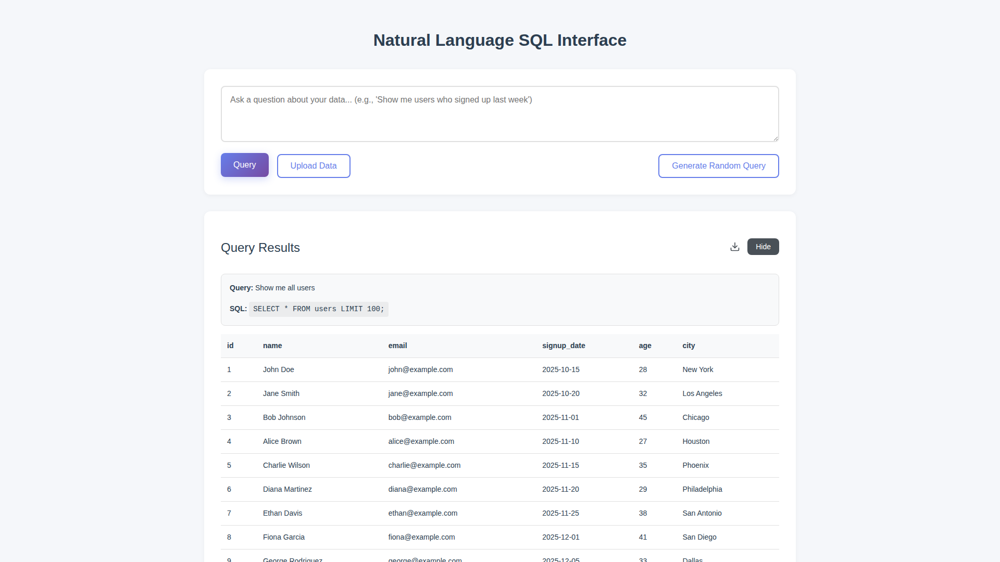
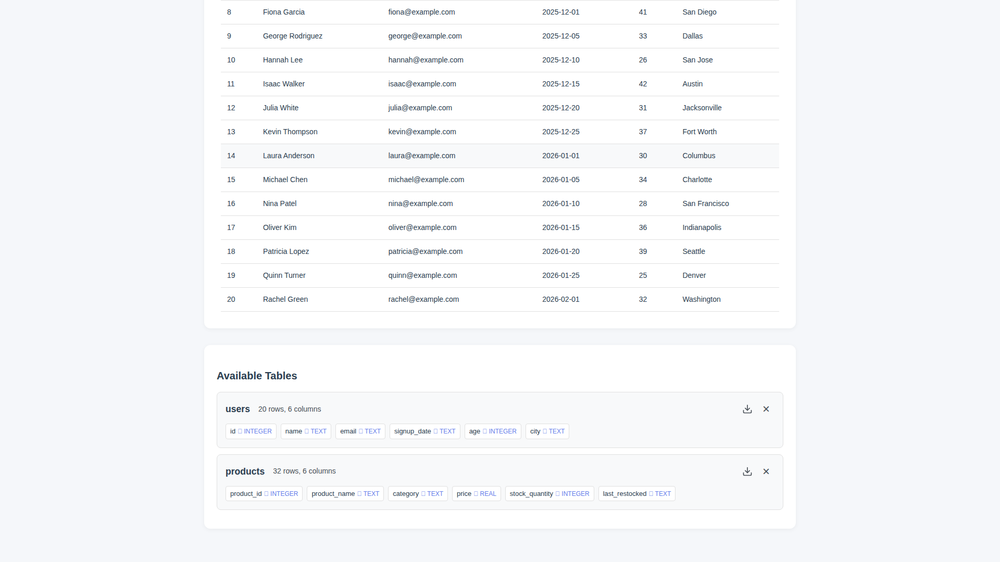

# One-Click CSV Export Feature

**ADW ID:** 6f39aae6
**Date:** 2026-01-02
**Specification:** specs/issue-4-adw-6f39aae6-sdlc_planner-one-click-table-exports.md

## Overview

This feature adds CSV export capabilities to the Natural Language SQL Interface application. Users can now export table data and query results with a single click via intuitive download buttons placed next to existing controls. The feature includes two new backend API endpoints and integrated frontend UI components with comprehensive error handling and security validation.

## Screenshots


*Download buttons appear next to the remove (×) button for each table in the Available Tables section*


*Download button appears next to the Hide button in the Query Results section*


*Download functionality works across all available tables*

## What Was Built

- **Table Export Endpoint**: `GET /api/table/{table_name}/export` - Exports complete table data as CSV
- **Query Export Endpoint**: `POST /api/query/export` - Exports query results as CSV
- **Frontend Download Buttons**: Intuitive download icons positioned next to existing action buttons
- **API Client Methods**: `exportTable()` and `exportQueryResults()` for triggering downloads
- **Comprehensive Unit Tests**: 304 lines of test coverage validating all export scenarios
- **E2E Test Suite**: End-to-end validation of the complete export workflow

## Technical Implementation

### Files Modified

- `app/server/server.py`: Added two new export endpoints with CSV generation logic (114 lines added)
- `app/server/tests/test_export.py`: Comprehensive unit tests for export functionality (304 lines, new file)
- `app/client/src/api/client.ts`: Added `exportTable()` and `exportQueryResults()` methods with blob download handling (64 lines added)
- `app/client/src/main.ts`: Integrated download buttons into table and results displays (159 lines modified)
- `app/client/src/style.css`: Styled download buttons to match existing UI patterns (38 lines added)
- `.claude/commands/e2e/test_table_exports.md`: E2E test specification (45 lines, new file)

### Key Changes

- **CSV Generation**: Uses Python's built-in `csv` module for RFC 4180 compliant CSV formatting with automatic escaping and encoding (UTF-8)
- **Streaming Response**: Backend uses FastAPI's `StreamingResponse` for efficient memory usage with large datasets
- **Security Validation**: Table names are validated using existing `validate_identifier()` from the security module to prevent SQL injection
- **Download Icon**: SVG arrow-down icon for crisp rendering at all sizes, consistent with modern UI patterns
- **State Management**: Frontend stores `lastQueryRequest` to enable re-execution of queries for export functionality

## How to Use

### Exporting Table Data

1. Navigate to the application homepage
2. Upload a CSV file or ensure tables are available in the database
3. Locate the table you want to export in the "Available Tables" section
4. Click the download button (arrow icon) to the left of the × button
5. The browser will download a CSV file named `{table_name}.csv` containing all table data

### Exporting Query Results

1. Enter a natural language query in the query input field
2. Click "Run Query" to execute the query
3. Once results are displayed, locate the download button in the results header
4. Click the download button (arrow icon) to the left of the "Hide" button
5. The browser will download a CSV file named `query_results.csv` containing the query results

## Configuration

No additional configuration is required. The export feature works out-of-the-box with the existing application setup.

### Default Behavior

- **Table Export Filename**: `{table_name}.csv`
- **Query Export Filename**: `query_results.csv`
- **CSV Format**: UTF-8 encoded, RFC 4180 compliant
- **Content-Type**: `text/csv`
- **Content-Disposition**: `attachment` (triggers browser download)

## Testing

### Running Unit Tests

```bash
cd app/server && uv run pytest
```

The test suite includes:
- Successful table export validation
- Table not found error handling (404)
- Invalid table name security validation (400)
- Successful query export validation
- Empty result set handling (CSV with headers only)
- Query error handling
- CSV format correctness validation

### Running E2E Tests

```bash
# Read the E2E test instructions
cat .claude/commands/test_e2e.md

# Execute the table exports E2E test
cat .claude/commands/e2e/test_table_exports.md
```

### Edge Cases Covered

- **Empty Tables**: Exports CSV with column headers only
- **Special Characters**: Column/table names with special characters are properly escaped
- **Unicode Data**: UTF-8 encoding handles international characters correctly
- **Large Datasets**: Streaming response prevents memory issues with large result sets
- **Concurrent Requests**: Multiple simultaneous exports are handled independently
- **SQL Injection Attempts**: Security validation rejects malicious table names

## Notes

- The query export endpoint re-executes the query to ensure fresh data rather than caching results
- Future enhancement consideration: Support for multiple export formats (JSON, Excel) via dropdown selector
- Future enhancement consideration: Filename customization or timestamps in filenames
- UTF-8 BOM could be added in the future for improved Excel compatibility if needed
- The download icon uses SVG for crisp rendering at all screen resolutions
- All existing tests continue to pass with zero regressions
